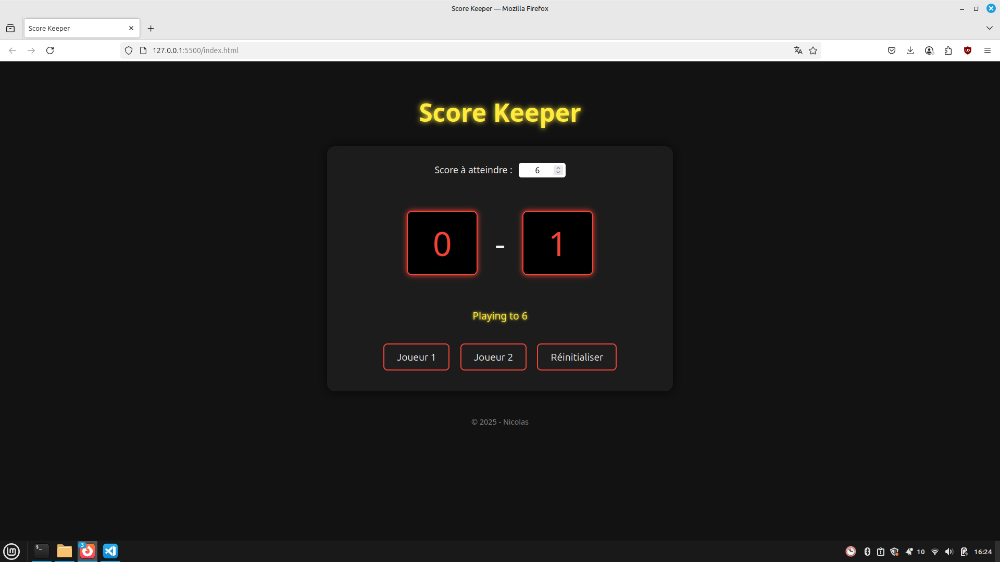

#  Score Keeper

**Score Keeper** est une application web interactive où deux joueurs s'affrontent pour atteindre un score défini.  
Chaque clic rapproche un joueur de la victoire, dans une interface inspirée des tableaux de score sportifs.

---

##  Fonctionnalités

-  **Définition du score maximal à atteindre** avant le début de la partie
-  **Affichage dynamique** du score des deux joueurs
-  **Contrôles interactifs** :
  - `+1 Joueur 1` ➕ Incrémente le score du joueur 1
  - `+1 Joueur 2` ➕ Incrémente le score du joueur 2
  - `Réinitialiser` 🔄 Remet les scores à zéro et relance une nouvelle manche
-  **Message de victoire automatique** dès qu’un joueur atteint le score cible
-  **Texte "Playing to X"** mis à jour dynamiquement
- **Design responsive** façon panneau de score sportif (grâce à SASS)

---

##  Technologies utilisées

- **HTML sémantique**
- **CSS / SASS**
- **JavaScript Vanilla (ES6)**
- **DOM API**

---

## ▶ Comment jouer

1. Choisissez un **score à atteindre** dans le sélecteur.
2. Cliquez sur les boutons **Joueur 1** ou **Joueur 2** pour ajouter des points.
3. Le premier joueur à atteindre le score gagne.
4. Utilisez le bouton **Réinitialiser** pour recommencer une partie à zéro.

---
##  Aperçu

 

---

##  Objectifs pédagogiques

- Apprendre à **manipuler le DOM avec JavaScript**
- Gérer des **événements utilisateurs**
- Créer une **interface réactive** en temps réel
- Structurer un projet avec **HTML sémantique**
- Utiliser **SASS** pour un style maintenable et modulaire

---

## 👨 Auteur

Projet réalisé par **Nicolas** dans le cadre de la formation **Développeur Front-End** chez Simplon (2025).  

